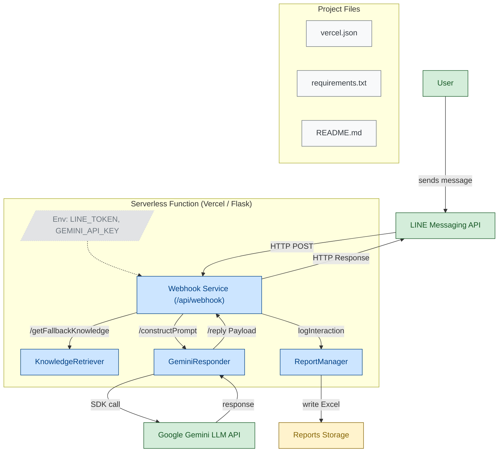

# 臨時抱佛腳智慧學習助理 (Smart Study Assistant)

這是一個基於 **Google Gemini LLM** 的智慧學習助手，提供學生在考試前的即時複習輔助。使用者可以透過 **LINE** 上傳文字或圖片，AI 會根據教材知識與內建 fallback 知識回答問題，並且加入安全防護，避免洩漏敏感資訊或被 prompt injection 攻擊。

---

## 功能特色

- 💬 **文字互動**：使用者可以問任何學科問題，AI 會根據內建知識回答。
- 🖼 **圖片解析**：可上傳圖片，AI 會分析內容並給出學習建議。
- 🛡 **安全防護**：
  - 防止 LLM 洩漏系統或機敏資訊
  - 防止 prompt injection 與 jailbreak
  - 過濾不合理或超長訊息
- 📊 **使用紀錄**：所有互動會紀錄，可匯出 Excel 做分析（選用）。

> ⚠️ 已去除 PDF 上傳與解析功能，以減少部署體積與依賴。

---

## 環境需求

- Python 3.10+
- 必須安裝以下套件：
  ```bash
  pip install flask requests pandas openpyxl google-generativeai
  ```

* LINE Messaging API **Channel Access Token**
* Google Gemini **API Key**

---

## 專案結構



### 檔案說明

* **api/webhook.py**：Flask Webhook，處理 LINE 訊息並呼叫 AI 模組。
* **src/gemini_responder.py**：負責與 Google Gemini LLM 互動，包含安全過濾層。
* **src/knowledge_retriever.py**：提供 fallback 學習知識，協助回答問題。
* **src/report_manager.py**：紀錄使用者互動，可選擇匯出 Excel。

---

## 使用方式

1. 設定環境變數：

   ```bash
   export LINE_CHANNEL_ACCESS_TOKEN="你的LINE Token"
   export GEMINI_API_KEY="你的Google Gemini API Key"
   ```

2. 啟動 Flask 服務：

   ```bash
   python api/webhook.py
   ```

3. 在 LINE Bot 後台設定 Webhook URL：

   ```
   https://your-domain.com/api/webhook
   ```

4. 用 LINE 發訊息或上傳圖片，AI 將會回覆學習建議或答案。

---

## 安全與限制

* LLM **不會**回答與學習無關的敏感資訊問題。
* 超過 **500 字** 的文字訊息會被截斷。
* 超長或惡意訊息會被過濾。
* 圖片解析僅提供學習內容分析，不會做臉部辨識或個資推測。

---

## 開發者建議

* 若部署於 Vercel，請確保：

  * 套件總大小 < 250 MB
  * Serverless Function 記憶體與 Timeout 設定合理
* 若未來加入 PDF 功能，可用 **PyMuPDF / pdfplumber** 並注意 context window 限制。

---

## 範例互動

```
使用者：請解釋 1+1 為什麼等於 2？
AI：1+1=2，因為加法是將兩個數字的量合併，得到總量。

使用者：這是我的課程圖片，請幫我複習
AI：圖片中提到的概念主要是二次函數的頂點公式，你可以先記住 y=ax^2+bx+c 的圖形特性...
```

---
